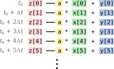
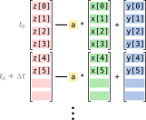

## Characteristics of Python

Python is an incredibly popular, powerful, and easy-to-use programming
language. Unfortunately, its popularity and ease-of-use are in many
parts due to design trade-offs that it has made that reduce its
performance, or make it more difficult to make go faster.

### Compiled and interpreted languages

Programming languages are frequently divided into two categories:
compiled languages, and interpreted languages. Interpreted languages,
such as Python, supply a program called an "interpreter", which reads
input files line-by-line and translates them into instructions that
the computer knows how to execute. Once a line has been executed, the
interpreter then finds the next line, and translates that.

Compiled languages, on the other hand, supply a program called a
"compiler", which translates the entire program into machine code at
once, and then the program can be run directly with no further
intervention. This removes a significant amount of overhead from
running the program, since translating the program to machine code has
already been done. C, C++, and Fortran are examples of compiled
languages.

### Explicit and implicit typing

In some languages, like C, all variables must be told what data type
they hold. For example, some might hold integers or floating-point
numbers, and others may hold arrays of these. Similarly, functions
must declare what types they expect to be given, and what types they
will return; for example, the exponentiation function might take two
floating-point numbers and return floating-point number.

In Python, on the other hand, this is not necessary. Variables
automatically pick up their type when they are created, and functions
will operate on any type of data they are given (at least until they
encounter some behaviour that doesn't work, at which point they will
generate an error). (This is called "duck typing"&mdash;if a variable
looks like a duck and quacks like a duck, and those are the only
requirements that the function places on its arguments, then as far as
that function is concerned then the variable is a duck, even if on
closer inspection it turns out to be a cardboard cutout of a duck
with a duck impressionist hiding behind it!)

This has two consequences. Firstly, every value needs to carry around
with it information about what type it is. In an explicitly typed
language, this could be attached to the name, instead, significantly
reducing the volume of data stored in a particular variable. Secondly,
functions&mdash;even very small internal utility functions&mdash;need
to be able to operate on any kind of data thrown at them. For example,
consider the function:

~~~
def add_two_numbers(x, y):
    return x + y
~~~
{: .language-python}

If `x` and `y` are both integers, or both floating-point numbers,
then this function becomes a single processor instruction. However,
in Python, the function must first check the labels of `x` and `y`
to find out what types they are, then look to see whether it knows
how to add those two types, then unpack the numbers stored inside
and pass them to the CPU to add together. This overhead is easily
tens if not hundreds of times the time it would take to do the
single instruction in an explicitly typed, compiled language.

As such, one aim when trying to make Python go faster is to have as
little code as possbile executed by the standard Python interpreter,
and instead find other ways to execute things that will have less
overhead.

### The Global Interpreter Lock

A common way to gain speed in many languages is to use multiple "threads"
to allow a program to operate in parallel. However, this comes with some
dangers, since different threads can interfere with each others' operation.
In an interpreted language like Python, this is especially complicated,
since entire functions could change between when the program decides to run
it and when it is actually run. To avoid these kinds of risks, Python
(more specifically, the most common Python interpreter, CPython) uses
a "Global Interpreter Lock", to ensure that only one thread is allowed to
be actively running at a time. This means that in most computational
softwaer, there is no performance increase to be gained from using multiple
threads within Python. Instead, other methods need to be used in order
to run in parallel.

## High Performance Computing Hardware

Modern computers and supercomputers have a variety of hardware
enhancements that allow them to go faster. To start from the smallest
scales and work upwards:

### Vector units

We tend to think of CPUs as acting on single variables at a time, and
write programs in those terms. For example, for the loop:

~~~
for i in range(1000):
    z[i] = a * x[i] + y[i]
~~~
{: .language-python}

then this would expand as:

~~~
z[0] = a * x[0] + y[0]
z[1] = a * x[1] + y[1]
z[2] = a * x[2] + y[2]
z[3] = a * x[3] + y[3]
...
~~~
{: .language-python}

However, most processors can now in fact do multiple of these operations
at a single time. Provided that all elements are the same type, then
depending on the processor and data type, then 4, 8, or even 16
iterations of this loop can happen at a single time.

Compare the execution of a loop element-by-element sequentially:

with the execution of a vectorised loop:

The vectorised loop can be up to $N$ times faster, where $N$ is the number
of elements that fit into the processor's vector units.

Plain Python loops cannot be vectorised, since elements of a list aren't
guaranteed to be the same type, and aren't laid out in memory correctly
(due to the wrapping that they have to indicate their type). So in order
to get access to the performance of the vector units, we need to use
something other than plain Python loops.

### CPU cores

The days when CPUs had a single core that operated sequentially are
long gone; even mobile phone and Raspberry Pi CPUs are now multi-core.
If we want our programs to utilise the full performance that the CPU
has to offer, then it must be parallel&mdash;i.e. it must be able to
perform multiple pieces of work at once.

While one way to achieve this is simply to run multiple programs on a
single CPU, one per core, this is not always optimal. Frequently, each
program may need more than its share of the bandwidth available between
the CPU and the system RAM, and so all will run slowly. By parallelising
a single application instead, this memory use can be optimised so that
the different cores co-operate better, and are able to run faster as
a result.

### GPUs

Many computers and supercomputers now have GPU accelerators, which can
run certain kinds of software many times faster than a similarly-priced
CPU can. However, since these are special-purpose devices that can only
perform a limited range of operations compared to a CPU, they cannot
run Python code directly; they can only run compiled machine code, and
transferring data and instructions is sufficiently slow that compiling
instructions on the CPU and transferring them to the GPU to execute does
not lead to any performance improvement.

In order to take advantage of GPUs from Python, specific libraries must
be used that know how to utilise them. These may be libraries that
target one specific class of problem and know how to solve them using
GPUs, or they may be able to compile Python code directly to be runnable
on the GPU. An example of the former would be Tensorflow, which provides
very efficient machine learning algorithms that run on the GPU; an example
of the latter would be Numba, which will be covered later in this lesson.

### Nodes

Sometimes no matter hard you try, you cannot get the performance you need
for your application from a single node, and instead need to parallelise
to multiple nodes. In most supercomputers, nodes are linked together with
a high-speed network (also referred to as an "interconnect" or a "fabric"),
which is important when multiple nodes are cooperating on the same problem.
Most problems have at least a little coupling between different parts,
and so the slowdown that would be seen by using a more conventional network
like Ethernet for communications between the parts would mean that the
program would slow down so much that running on a single node would be quicker.
